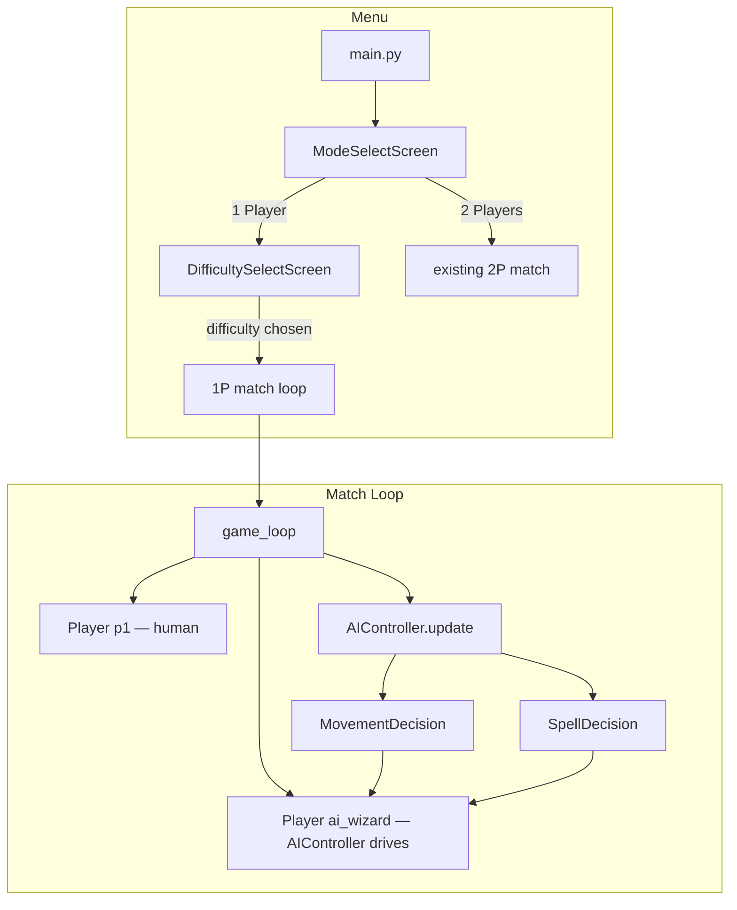

# Design Document: AI Opponent

## Overview

This feature adds a computer-controlled wizard opponent to Wiz Bash, enabling single-player matches. The AI is implemented as an `AIController` class that wraps an existing `Player` instance and drives it each frame — replacing keyboard input with decision logic. A pre-game menu flow (Mode Select → Difficulty Select) is added before the match begins.

The design deliberately keeps the AI as a thin layer on top of the existing `Player` API. The `Player` class is not modified; the `AIController` calls the same public methods (`try_cast`, movement via direct position updates) that the game loop already uses for human players. This means two-player mode is completely unaffected.

### Key Design Decisions

- **No changes to `Player`**: The AI drives a `Player` by synthesising the same inputs the game loop already provides, keeping the existing class stable.
- **Reaction delay via timestamp gating**: Rather than threading or coroutines, the AI stores a "next action time" per decision category and only updates when `now >= next_action_time`. This is simple, deterministic, and frame-rate independent.
- **Lead-aiming as a pure function**: Projectile lead calculation is a stateless function that can be unit-tested independently of pygame.
- **Difficulty as a dataclass**: All per-difficulty constants live in a `DifficultyConfig` dataclass, making it easy to add new difficulties or tweak values.

---

## Architecture



The existing `main()` function is refactored into a `run_game(mode, difficulty)` function. A new `show_mode_select()` and `show_difficulty_select()` function handle the menu screens and return the chosen values before calling `run_game`.

---

## Components and Interfaces

### `DifficultyConfig` (dataclass, `ai_controller.py`)

Holds all tunable constants for one difficulty level.

```python
@dataclass
class DifficultyConfig:
    name: str               # "Easy" | "Medium" | "Hard"
    reaction_delay: int     # ms — how often AI re-evaluates decisions
    cast_accuracy: float    # 0.0–1.0 — probability AI actually fires when it "wants" to
    ignore_threat_prob: float  # probability AI ignores a detected threat (Easy: 0.4, others: 0.0)
    random_spell_select: bool  # True on Easy — pick offensive spell randomly
```

Pre-built configs:

```python
EASY   = DifficultyConfig("Easy",   reaction_delay=800, cast_accuracy=0.60, ignore_threat_prob=0.40, random_spell_select=True)
MEDIUM = DifficultyConfig("Medium", reaction_delay=400, cast_accuracy=0.85, ignore_threat_prob=0.00, random_spell_select=False)
HARD   = DifficultyConfig("Hard",   reaction_delay=100, cast_accuracy=1.00, ignore_threat_prob=0.00, random_spell_select=False)
```

### `AIController` (`ai_controller.py`)

The central decision-making class.

```python
class AIController:
    def __init__(self, ai_wizard: Player, config: DifficultyConfig): ...

    def update(self, now: int, dt: int,
               human: Player, projectiles: list[Projectile],
               arena_rect: pygame.Rect) -> Projectile | None:
        """
        Called once per frame. Returns a new Projectile if the AI casts
        an offensive spell, otherwise None.
        Mutates ai_wizard.x / ai_wizard.y for movement.
        """
```

Internal helpers (all pure functions or methods with no side effects beyond returning values):

| Helper | Purpose |
|---|---|
| `_detect_threats(projectiles, ai_wizard)` | Returns list of projectiles on collision course |
| `_choose_movement(human, threats, arena_rect, now)` | Returns `(dx, dy)` movement vector |
| `_choose_spell(human, now)` | Returns spell index to cast, or `None` |
| `_lead_target(ai_wizard, human, spell_speed)` | Returns `(tx, ty)` lead-aim point |
| `_should_cast_defensive(human, threats, now)` | Returns defensive spell index or `None` |

### Menu screens (`menu.py`)

Two simple functions that run their own pygame event loops and return a value:

```python
def show_mode_select(screen, fonts) -> str:
    """Returns "1p" or "2p"."""

def show_difficulty_select(screen, fonts) -> DifficultyConfig:
    """Returns one of EASY, MEDIUM, HARD."""
```

### `main.py` changes

- `main()` calls `show_mode_select` → optionally `show_difficulty_select` → `run_game(mode, difficulty)`.
- `run_game` creates the `AIController` when `mode == "1p"` and calls `ai_controller.update(...)` each frame instead of `p2.handle_input(keys, ...)`.
- HUD rendering checks `mode` to show "CPU" label and correct victory text.

---

## Data Models

### `DifficultyConfig` fields (see above)

### AI internal state (stored on `AIController`)

```python
self._next_move_time:  int   # timestamp after which movement may be updated
self._next_cast_time:  int   # timestamp after which casting may be attempted
self._move_dx:         float # current movement direction x component
self._move_dy:         float # current movement direction y component
```

### Threat detection

A projectile is classified as a **Threat** when:

1. It is owned by the human player (`p.owner is human`).
2. The time-to-closest-approach is positive (projectile is still approaching).
3. The minimum distance along the projectile's trajectory to the AI wizard's centre is less than `ai_wizard.size * 1.5` pixels.

```python
def _is_threat(proj: Projectile, ai_wizard: Player) -> bool:
    # Vector from projectile to AI centre
    ax, ay = ai_wizard.center
    rx, ry = ax - proj.x, ay - proj.y
    # Project onto projectile velocity
    speed_sq = proj.dx**2 + proj.dy**2
    if speed_sq == 0:
        return False
    t = (rx * proj.dx + ry * proj.dy) / speed_sq
    if t < 0:
        return False  # already passed
    # Closest point
    cx = proj.x + proj.dx * t
    cy = proj.y + proj.dy * t
    dist = math.hypot(cx - ax, cy - ay)
    return dist < ai_wizard.size * 1.5
```

### Lead-aim calculation

```python
def _lead_target(ai_wizard: Player, human: Player, spell_speed: float,
                 human_vel: tuple[float, float]) -> tuple[float, float]:
    """
    Returns the predicted position of the human at the time a projectile
    fired now would reach them, assuming constant velocity.
    Falls back to current human centre if no solution exists.
    """
    hx, hy = human.center
    ax, ay = ai_wizard.center
    vx, vy = human_vel
    dist = math.hypot(hx - ax, hy - ay)
    if spell_speed <= 0:
        return hx, hy
    t = dist / spell_speed  # approximate time of flight
    return hx + vx * t, hy + vy * t
```

Human velocity is estimated each frame by comparing the human's position to the previous frame's position and dividing by `dt`.

---

## Correctness Properties

*A property is a characteristic or behavior that should hold true across all valid executions of a system — essentially, a formal statement about what the system should do. Properties serve as the bridge between human-readable specifications and machine-verifiable correctness guarantees.*

### Property 1: Engagement distance maintenance

*For any* AI wizard position and human wizard position with no active threats, the movement vector produced by `_choose_movement` shall point in a direction that reduces the distance error relative to the 200–350 px engagement band (i.e., moves closer when farther than 350 px, moves away when closer than 200 px, and produces near-zero net radial movement when already in band).

**Validates: Requirements 3.1**

---

### Property 2: Perpendicular evasion direction

*For any* threat projectile with a non-zero velocity vector, the movement vector produced by `_choose_movement` shall be nearly perpendicular to the projectile's direction of travel — specifically, the absolute dot product of the normalised movement vector and the normalised projectile velocity shall be less than 0.5.

**Validates: Requirements 3.2**

---

### Property 3: Boundary avoidance

*For any* AI wizard position within 80 pixels of any arena boundary, the movement vector produced by `_choose_movement` shall have a component pointing away from that boundary (i.e., the component along the inward normal of the nearest boundary is positive).

**Validates: Requirements 3.3**

---

### Property 4: Reaction delay gates movement updates

*For any* sequence of `update` calls where consecutive timestamps are spaced less than `reaction_delay` milliseconds apart, the AI wizard's movement direction shall not change between those calls.

**Validates: Requirements 3.4**

---

### Property 5: Offensive spell is always available and within mana

*For any* game state where the AI wizard's mana is ≥ 20 and at least one offensive spell is not on cooldown, `_choose_spell` shall return an index corresponding to an offensive spell that is not on cooldown and whose mana cost does not exceed the AI wizard's current mana.

*This subsumes the cooldown-fallback requirement (4.3): the returned spell is always available, never the preferred-but-on-cooldown spell.*

**Validates: Requirements 4.1, 4.3**

---

### Property 6: Spell preference follows game state

*For any* game state where the human wizard's HP is above 50% and multiple offensive spells are available, `_choose_spell` (on non-Easy difficulty) shall return the spell with the highest damage value among available offensive spells. *For any* game state where the human wizard is moving at speed > 3 px/frame, `_choose_spell` shall return the spell with the highest projectile speed among available offensive spells.

**Validates: Requirements 4.2**

---

### Property 7: Lead-aim point is ahead of the human

*For any* human wizard position, velocity vector, and spell speed > 0, `_lead_target` shall return a point that is displaced from the human's current centre in the direction of the human's velocity — specifically, the dot product of `(lead_point − human_centre)` and the human's velocity vector shall be non-negative.

**Validates: Requirements 4.4**

---

### Property 8: Low mana suppresses offensive casting

*For any* game state where the AI wizard's mana is in the range [0, 19], `_choose_spell` shall return `None` (no offensive spell is cast).

**Validates: Requirements 4.5**

---

### Property 9: Defensive spell priority ordering

*For any* game state with a single threat and Shield available, `_should_cast_defensive` shall return the Shield spell index with probability proportional to `(1 − hp_ratio)`. *For any* game state with two or more simultaneous threats and Counterspell available, `_should_cast_defensive` shall return the Counterspell index. *For any* game state with a threat present and both Shield and Counterspell unavailable but Blink available, `_should_cast_defensive` shall return the Blink index.

*These three sub-cases form a single priority-ordered defensive decision tree and are combined here to avoid redundancy.*

**Validates: Requirements 5.1, 5.2, 5.4**

---

### Property 10: Heal at critical HP

*For any* game state where the AI wizard's HP is below 30% of max HP, Heal is not on cooldown, and no threats are detected, `_should_cast_defensive` shall return the Heal spell index.

**Validates: Requirements 5.3**

---

### Property 11: Low mana suppresses defensive casting (with Heal exception)

*For any* game state where the AI wizard's mana is in the range [0, 29] and HP is ≥ 15% of max HP, `_should_cast_defensive` shall return `None`. *For any* game state where mana is in [0, 29] and HP is < 15% of max HP, `_should_cast_defensive` shall return either the Heal spell index or `None` (no other defensive spell).

**Validates: Requirements 5.5**

---

### Property 12: Easy difficulty ignores threats stochastically

*For any* game state on Easy difficulty with a detected threat, over a large number of independent trials the AI shall ignore the threat (take no evasive action) with a proportion close to 0.40 (within ±0.05 statistical tolerance at N=1000 trials).

**Validates: Requirements 6.1**

---

### Property 13: Easy difficulty uses uniform random spell selection

*For any* game state on Easy difficulty where all offensive spells are available, over a large number of independent trials each offensive spell shall be selected with roughly equal probability — no single spell shall be selected more than twice as often as any other.

**Validates: Requirements 6.4**

---

## Error Handling

| Scenario | Handling |
|---|---|
| All offensive spells on cooldown | `_choose_spell` returns `None`; AI skips casting that frame |
| All defensive spells on cooldown or insufficient mana | `_should_cast_defensive` returns `None`; AI skips defensive action |
| Human wizard is dead (match over) | `AIController.update` is not called after winner is determined; no guard needed inside the controller |
| AI wizard reaches arena boundary | Boundary avoidance in `_choose_movement` prevents leaving the arena; position is also clamped by the existing `Player.handle_input` boundary logic (reused via direct position update) |
| `spell_speed == 0` in `_lead_target` | Function returns human's current centre as fallback (instant spells don't need lead aim) |
| `dt == 0` (frame stall) | Velocity estimate returns `(0, 0)`; lead aim falls back to current position; no division by zero |

---

## Testing Strategy

### Unit Tests (example-based)

Focus on specific, concrete scenarios:

- Mode select screen returns `"1p"` when "1 Player" is chosen, `"2p"` for "2 Players"
- Difficulty select screen returns the correct `DifficultyConfig` preset for each option
- `DifficultyConfig` presets have the exact reaction_delay, cast_accuracy, ignore_threat_prob, and random_spell_select values specified in the requirements
- HUD renders "CPU" and difficulty name in 1p mode
- Victory message is "You Win!" when human wins in 1p mode, "CPU Wins!" when AI wins
- `_is_threat` correctly classifies a projectile heading directly at the AI as a threat and one heading away as not a threat

### Property-Based Tests

Use [Hypothesis](https://hypothesis.readthedocs.io/) (Python property-based testing library). Each test runs a minimum of 100 iterations.

Each test is tagged with a comment in the format:
`# Feature: ai-opponent, Property N: <property_text>`

| Property | Test description |
|---|---|
| Property 1 | Generate random (ai_pos, human_pos) pairs; verify movement direction reduces distance error |
| Property 2 | Generate random threat projectile velocities; verify evasion is near-perpendicular |
| Property 3 | Generate AI positions within 80px of each boundary; verify movement has inward component |
| Property 4 | Generate timestamp sequences with gaps < reaction_delay; verify movement direction unchanged |
| Property 5 | Generate game states with mana ≥ 20 and at least one spell available; verify returned spell is offensive and available |
| Property 6 | Generate states with human HP > 50%; verify highest-damage spell chosen. Generate fast-moving human states; verify fastest spell chosen |
| Property 7 | Generate random positions and velocities; verify lead point is ahead of human |
| Property 8 | Generate mana values in [0, 19]; verify `_choose_spell` returns None |
| Property 9 | Generate states for each threat/availability combination; verify correct defensive spell returned |
| Property 10 | Generate HP values in [1, 29%], Heal available, no threats; verify Heal is chosen |
| Property 11 | Generate mana in [0, 29] with HP ≥ 15%; verify None returned. Generate mana in [0, 29] with HP < 15%; verify only Heal or None |
| Property 12 | Run 1000 trials on Easy with threat; verify ignore rate ≈ 0.40 ± 0.05 |
| Property 13 | Run 1000 trials on Easy with all spells available; verify uniform distribution |

### Integration Tests

- Full 1p match loop: AI controller drives the AI wizard for 10 seconds of simulated time without crashing
- AI wizard never leaves the arena bounds during a simulated match
- Restart flow returns to mode select screen after a match ends
